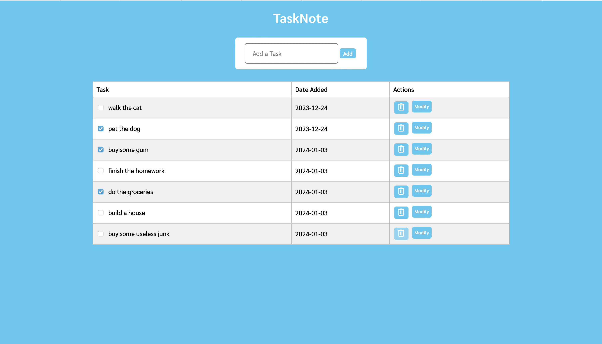

# Task Note
A simple to-do list web app.

## How to get started
1. Go to https://task-note-6ed393d157fd.herokuapp.com
2. In the "Add Task" bubble, add a task
3. When you're done with a task cross it off or delete it!

## Features
- Adding a Task
  - Task gets sent to backend and is posted
  - Tasks get validated: no empty task can be posted

- Updating a Task
  - By clicking the "modify" button, you can update a task

- Crossing off a task
  - By clicking the checkbox on the left of a task, you can cross off a task

- Deleting a Task
  - You can delete a task by clicking the trash icon and it will erase it from the database

## How The Web App Looks

